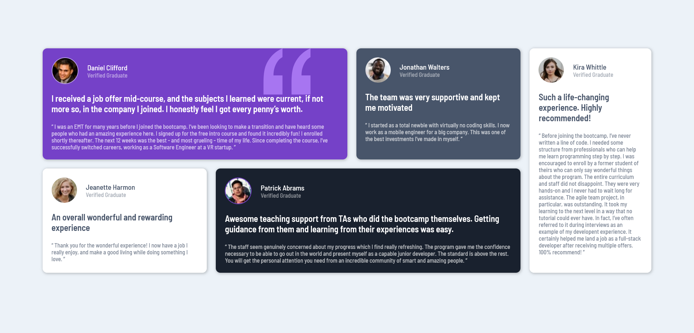

# Frontend Mentor - Testimonials grid section solution

 Welcome! 👋

Thanks for checking out this front-end coding challenge.

This is a solution to the [Testimonials grid section challenge on Frontend Mentor](https://www.frontendmentor.io/challenges/testimonials-grid-section-Nnw6J7Un7). Frontend Mentor challenges help you improve your coding skills by building realistic projects. 

## Table of contents

- [Overview](#overview)
  - [The challenge](#the-challenge)
  - [Screenshot](#screenshot)
  - [Links](#links)

## Overview

### The challenge

Users should be able to:

- View the optimal layout for the site depending on their device's screen size

### Screenshot

### Links

- Solution: [GitHub](https://github.com/JustinasVe/testimonials-grid-section)
- Live: [Project preview](https://justinasve.github.io/testimonials-grid-section)

